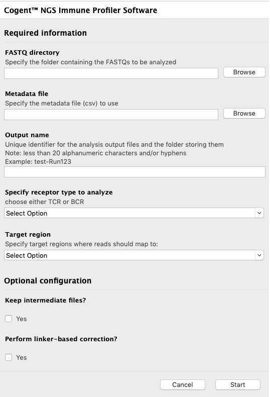
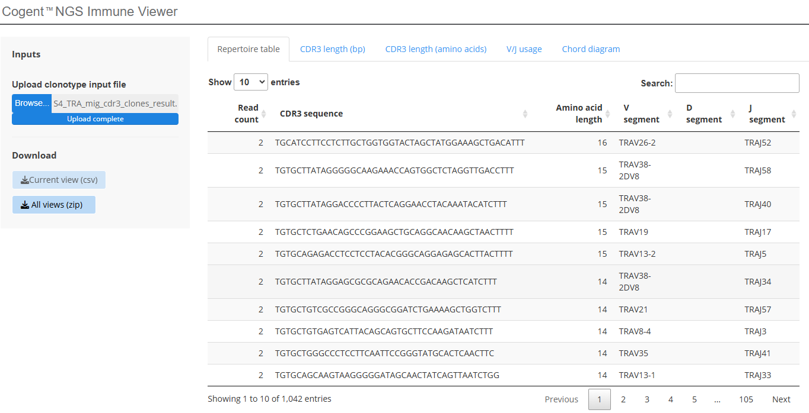

# immune_profiler

Immune profiling involves the analysis of T- and B-cell receptors (TCRs/BCRs), which allow cells to bind specific antigens, proliferate, and then rapidly mount a specific immune response. It offer a variety of kits for T- and B-cell profiling of human and mouse (BCR, TCR) samples to help researchers investigate immune cell development, examine mechanisms of autoimmune diseases and cancers, and develop models for immunotherapy of specific diseases.

The python source use new ImmuneProfilerv1.6.jar linked to MIGEC1.2.9 and MIXCR3 with BCRv1,BCRv2,TCRv1,TCRv2 kits as arguments to analyze TCR/BCR sub chains and clonotype

## GUI for executing immune_profile to analyze the TCR/BCR raw data

## The tool for immune_profile_viewer to display the analysis results

please use the link below to upload the file "report/S/S4_TRA_mig_cdr3_clones_result.csv" to view the results

[Lets go to Viewer](https://bioinformatics-takarabiousa.shinyapps.io/Cogent_NGS_Immune_Viewer/)

## Viewer

